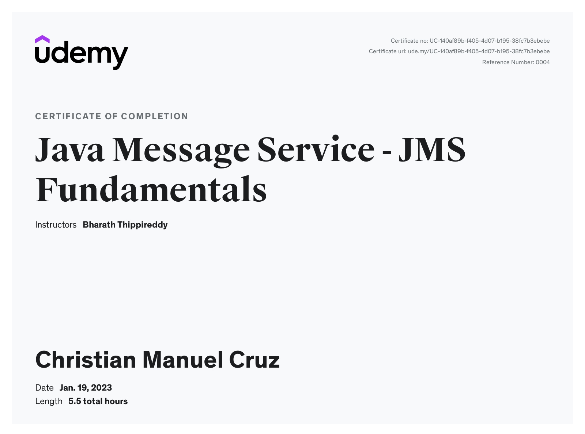

# JMS Fundamentals

Based on Bharath Thippireddy's Udemy course [JMS Fundamentals](https://www.udemy.com/course/java-message-service-jms-fundamentals/)

# Completion Certificate



- [JMS Fundamentals](#jms-fundamentals)
- [Completion Certificate](#completion-certificate)
  - [Installing the Broker](#installing-the-broker)
  - [WildFly installation](#wildfly-installation)
  - [Spring JMS](#spring-jms)
  - [Terminologies](#terminologies)
    - [Messaging](#messaging)
    - [Messaging Server](#messaging-server)
    - [JMS Models](#jms-models)
      - [Point to Point (p2p)](#point-to-point-p2p)
      - [PubSub](#pubsub)
    - [Session](#session)
  - [JMS 1.x API](#jms-1x-api)
    - [Booting up the Project](#booting-up-the-project)
    - [Writing Messages to the Queue](#writing-messages-to-the-queue)
    - [PubSub](#pubsub-1)
  - [JMS 2.0](#jms-20)
  - [JMS Message Anatomy](#jms-message-anatomy)
    - [Message Priority](#message-priority)
    - [replyTo Header](#replyto-header)
    - [Linking a Request to a Reply](#linking-a-request-to-a-reply)
    - [Expiry Time](#expiry-time)
    - [Adding Custom Message Properties](#adding-custom-message-properties)
    - [Message Types](#message-types)
    - [Asynchronous Processing](#asynchronous-processing)
    - [Load Balancing](#load-balancing)
  - [PubSub Messaging](#pubsub-messaging)
    - [Durable Subscription](#durable-subscription)
    - [Shared Subscription](#shared-subscription)
  - [Message Filtering](#message-filtering)
    - [Header Filtering](#header-filtering)
  - [Guaranteed Messaging](#guaranteed-messaging)
    - [AUTO\_ACKNOWLEDGE](#auto_acknowledge)
    - [DUPS\_OK\_ACKNOWLEDGE](#dups_ok_acknowledge)
    - [CLIENT\_ACKNOWLEDGE](#client_acknowledge)
  - [JMS Transactions](#jms-transactions)
  - [Security](#security)
  - [Message Grouping](#message-grouping)
  - [JavaEE](#javaee)
    - [Creating the Producer](#creating-the-producer)
    - [Creating the Servlet](#creating-the-servlet)
    - [Creating the MDB](#creating-the-mdb)
    - [Deployment](#deployment)

## Installing the Broker

After Apache ActiveMQ Artemis is downloaded, we run `artemis create pathTo/mybroker`. To run the broker, use `artemis run`. This starts the broker at port 8161. The etc/broker.xml is the configuration file.

## WildFly installation

The `/bin` directory contains all the binaries to be run. The `standalone` folder runs a full fledged standalone server. The `deployments` folder will be where the WAR files be hosted. We can start a standalone server using

```bash
standalone.bat -c standalone-full.xml
```

The configuration will be automatically picked up by WildFly. We can connect to the JBoss shell using

```bash
jboss-cli.bat
connect
```

Then we add a JMS queue named myQueue with a JDNI name queue/myQueue and java:jboss/exported/jms/queue/myQueue. The jboss/exported/jms is automatically added by JBoss when creating queues using the admin console. At runtime, we simply use queue/myQueue

```bash
jms-queue add --queue-address=myQueue --entries=queue/myQueue,java:jboss/exported/jms/queue/myQueue
```

To check if the queue was successfully created:

```bash
/subsystem=messaging-activemq/server=default/jms-queue=myQueue:read-resource
```

## Spring JMS

Spring introduces the JmsTemplate class which have methods for sending and receiving messages, without us needing to define connection factories and sessions. For this project, the required Spring Boot dependency is Spring for Apache ActiveMQ Artemis. To enable JMS support on a Spring Boot app, we just need to annotate the entrypoint with **@EnableJms**

```java
@SpringBootApplication
@EnableJms
public class SpringjmsApplication {
	public static void main(String[] args) {
		SpringApplication.run(SpringjmsApplication.class, args);
	}
}
```

We configure the queue name in application.properties, which we can inject using **@Value**

```
springjms.myQueue=myQueue
```

```java
@Component
public class MessageSender {
	@Autowired
	private JmsTemplate jmsTemplate;

	@Value("${springjms.myQueue}")
	private String queue;

	public void send(String message) {
		jmsTemplate.convertAndSend(queue, message);
	}
}
```

Creating a listener can be done by annotating a method with **@JmsListener**

```java
@Component
public class MyListener {

	@JmsListener(destination = "${springjms.myQueue}")
	public void receive(String message) {
		System.out.println("Message received " + message);
	}
}
```

## Terminologies

### Messaging

- The process of exchanging business data across components/applications. The message itself contains business data and may contain routing headers.
- Messaging allows heterogenous integration and loose coupling between applications that may be written in different languages
- Messaging uses asynchronous processing as well as allows multiple consumers as the load increases

### Messaging Server

- Also known as MOM (Message Oriented Middleware) is responsible for taking the incoming message and ensures that it is delivered to the receiver.
- Provides fault tolerance, load balancing, scalability, transaction management etc.
- Examples are ActiveMQ, SonicMQ, Websphere MQ, TibcoMQ

### JMS Models

#### Point to Point (p2p)

- Allows sending and receiving messages both synchronously (request/reply messaging) and asynchronously (fire and forget) through **queues**
- A message in the queue is consumed only once, and once consumed, it is removed from the queue

#### PubSub

- The messages are published into **topics** wherein there are multiple applications consuming the same message
- It is a push model wherein the messages are automatically broadcasted to the consumers without them requesting

### Session

- A unit of work in JMS

## JMS 1.x API

The JMS Provider provides us with the **ConnectionFactory** and **Destination** and puts them into the JNDI registry. We create a **Connection** from this ConnectionFactory and from the Connection we create a **Session**. Using the Session, we create **Message**, **MessageProducer**, **MessageConsumer**.

### Booting up the Project

The project uses maven-archetype-quickstart. The necessary dependencies are `artemis-jms-client-all`. We also need to create a `src/main/resources/jndi.properties file`

```properties
# Tells which the initial context will be
java.naming.factory.initial=org.apache.activemq.artemis.jndi.ActiveMQInitialContextFactory

# default location where jndi server runs
connectionFactory.ConnectionFactory=tcp://localhost:61616

# queue name, maps jndi to an object to be created dynamically at runtime
queue.queue/myQueue=myQueue
```

### Writing Messages to the Queue

The steps for sending a message to a queue in JMS 1.x are as follows:

1. Create a Connection to the JMS Server
2. Establish Session
3. Look up for the Destination
4. Send/Receive Message

```java
public class FirstQueue {
	public static void main(String[] args) {
		// access JNDI initial context using jndi.properties
		InitialContext initialContext = null;
		Connection connection = null;

		try {
			initialContext = new InitialContext();
			// retrieve connection factory from the jndi
			ConnectionFactory cf = (ConnectionFactory) initialContext.lookup("ConnectionFactory");
			// create connection
			connection = cf.createConnection();
			// create session
			Session session = connection.createSession();

			// jndi lookup
			Queue queue = (Queue) initialContext.lookup("queue/myQueue");
			// create producer
			MessageProducer producer = session.createProducer(queue);

			// send message
			TextMessage message = session.createTextMessage("Hello World");
			producer.send(message);
			System.out.println("Message sent: " + message.getText());

			// consume message
			MessageConsumer consumer = session.createConsumer(queue);
			connection.start();
			// receive the message
			TextMessage messageReceived = (TextMessage) consumer.receive(5000);
			System.out.println("Message received: " + messageReceived.getText());

		} catch (NamingException e) {
			e.printStackTrace();
		} catch (JMSException e) {
			// TODO Auto-generated catch block
			e.printStackTrace();
		}

		finally {
			if (initialContext !=null) {
				try {
					initialContext.close();
				} catch (NamingException e) {
					// TODO Auto-generated catch block
					e.printStackTrace();
				}
			}

			if (connection !=  null) {
				try {
					connection.close();
				} catch (JMSException e) {
					// TODO Auto-generated catch block
					e.printStackTrace();
				}
			}
		}
	}
}
```

To consume a message, we must call the **Connection.start()** method.

### PubSub

For creating topics, we add the following to the jndi.properties

```properties
topic.topic/myTopic=myTopic
```

```java
public class FirstTopic {
	public static void main(String[] args) throws Exception {
		// access JNDI initial context using jndi.properties
		InitialContext initialContext = null;
		Connection connection = null;
		initialContext = new InitialContext();

		// create the connection factory
		Topic topic = (Topic) initialContext.lookup("topic/myTopic");
		ConnectionFactory cf = (ConnectionFactory) initialContext.lookup("ConnectionFactory");
		connection = cf.createConnection();

		Session session = connection.createSession();
		MessageProducer producer = session.createProducer(topic);
		MessageConsumer consumer1 = session.createConsumer(topic);
		MessageConsumer consumer2 = session.createConsumer(topic);

		// send message
		TextMessage message = session.createTextMessage("Hello World");
		producer.send(message);

		// receive message
		connection.start();
		TextMessage message1 = (TextMessage) consumer1.receive();
		System.out.println("Consumer 1: " + message1);
		TextMessage message2 = (TextMessage) consumer2.receive();
		System.out.println("Consumer 2: " + message2);

		connection.close();
		initialContext.close();
	}
}
```

## JMS 2.0

In JMS 2.0 provides a simple API and uses **JMSContext** for the Connection and Session. We don't need to define the context, create connection factories and manually close these resources. We can also create our own custom ConnectionFactory using **@JMSConnectionFactoryDefinitions**.

```java
public class JMSContextDemo {

	public static void main(String[] args) throws NamingException {
		// retrieve queue from the jndi
		InitialContext context = new InitialContext();
		Queue queue = (Queue) context.lookup("queue/myQueue");

		// create a connection factory
		try(ActiveMQConnectionFactory cf = new ActiveMQConnectionFactory();
				JMSContext jmsContext = cf.createContext()) {
			// create producer and send message
			jmsContext.createProducer().send(queue, "Hello World");
			// read message
			String messageReceived = jmsContext.createConsumer(queue).receiveBody(String.class);
			System.out.println(messageReceived);
		}
	}
}
```

## JMS Message Anatomy

A JMS Message is divided into three parts:

**1. Header** - Contains metadata. There are Provider-set headers and Developer-set headers.
The Provider-set headers are:

- JMSDestination
- JMSDeliveryMode
- JMSMessageId
- JMSTimestamp
- JMSExpiration
- JMSRedelivered
- JMSPriority

The Developer-set headers are:

- JMSReplyTo
- JMSCorrelationID
- JMSType

**2. Properties**
App-Specific properties:

- setXXXProperty
- getXXXProperty

Provider-Specific properties

- JMSXUserID
- JMSXAppID
- JMSXProducerTXID
- JMSXConsumerTXID
- JMSXRcvTimestamp
- JMSDelvieryCount
- JMSXState
- JMSXGroupID
- JMSXGroupSeq

**3. Payload**

### Message Priority

Messages can be prioritized using the **JMSProducer.setPriorty()** method which takes a value from 0-9 with 9 being the highest priority. The default priority is 4.

```java
		try(ActiveMQConnectionFactory cf = new ActiveMQConnectionFactory();
				JMSContext jmsContext = cf.createContext()) {
			JMSProducer producer = jmsContext.createProducer();

			String[] messages = new String[3];
			messages[0] = "Hello";
			messages[1] = "World";
			messages[2] = "Doge";

			producer.setPriority(3);
			producer.send(queue, messages[0]);

			producer.setPriority(1);
			producer.send(queue, messages[1]);

			producer.setPriority(9);
			producer.send(queue, messages[2]);

			// consumer
			JMSConsumer consumer = jmsContext.createConsumer(queue);

			for (int i = 0; i < messages.length; i++) {
				System.out.println(consumer.receiveBody(String.class));
			}
		}
```

The above will result in the following:

```
Doge
Hello
World
```

### replyTo Header

Using the replyTo header, we can dynamically specify which queue to send a reply to. We can set the header on the message itself as follows:

```java
			// create producer and send message
			JMSProducer producer = jmsContext.createProducer();
			TextMessage message = jmsContext.createTextMessage("Hello World");
			message.setJMSReplyTo(replyQueue);
			producer.send(queue, message);

			// consumer consumes the message
			JMSConsumer consumer = jmsContext.createConsumer(queue);
			TextMessage messageReceived = (TextMessage) consumer.receive();
			System.out.println(messageReceived.getText());

			JMSProducer replyProducer = jmsContext.createProducer();
			replyProducer.send(messageReceived.getJMSReplyTo(), "This is a reply");

			// reply consumer consumes the reply
			JMSConsumer replyConsumer = jmsContext.createConsumer(messageReceived.getJMSReplyTo());
			System.out.println(replyConsumer.receiveBody(String.class));
```

The replyTo() method is useful in applications wherein the queues are dynamically created.

```java
TemporaryQueue replyQueue = jmsContext.createTemporaryQueue();
```

### Linking a Request to a Reply

When multiple applications are sending requests and replies, we need to associate a particular reply to a particular reqeust. We can use the **messageIED** and **correlationID** headers for this. By default, the JMS provider (artemis) already generates ids on our messages. We can link the initial request and response to a correlationID using a hash map.

```java
			// create producer and send message
			JMSProducer producer = jmsContext.createProducer();
			TemporaryQueue replyQueue = jmsContext.createTemporaryQueue();
			TextMessage message = jmsContext.createTextMessage("Hello World");
			message.setJMSReplyTo(replyQueue);
			producer.send(queue, message);
			System.out.println(message.getJMSMessageID());

			// assign messageid to a map
			Map<String, TextMessage> requestMessages = new HashMap<>();
			requestMessages.put(message.getJMSMessageID(), message);

			// consumer consumes the message
			JMSConsumer consumer = jmsContext.createConsumer(queue);
			TextMessage messageReceived = (TextMessage) consumer.receive();
			System.out.println(messageReceived.getText());

			JMSProducer replyProducer = jmsContext.createProducer();
			TextMessage replyMessage = jmsContext.createTextMessage("This is a reply");
			replyMessage.setJMSCorrelationID(messageReceived.getJMSMessageID());
			replyProducer.send(messageReceived.getJMSReplyTo(), replyMessage);

			// reply consumer consumes the reply
			JMSConsumer replyConsumer = jmsContext.createConsumer(messageReceived.getJMSReplyTo());
			TextMessage replyReceived = (TextMessage) replyConsumer.receive();
			System.out.println(replyReceived.getJMSCorrelationID());
			System.out.println(requestMessages.get(replyReceived.getJMSCorrelationID()).getText());
```

```java
ID:a679dfe7-9692-11ed-86aa-d8f88325b949
Hello World
ID:a679dfe7-9692-11ed-86aa-d8f88325b949
Hello World
```

### Expiry Time

The setTimeToLive() can be used to set an expiry time on a message.

```java
	public static void main(String[] args) throws NamingException, InterruptedException {
		// retrieve queue from the jndi
		InitialContext context = new InitialContext();
		Queue queue = (Queue) context.lookup("queue/myQueue");
		Queue expiryQueue = (Queue) context.lookup("queue/expiryQueue");

		// create a connection factory
		try(ActiveMQConnectionFactory cf = new ActiveMQConnectionFactory();
				JMSContext jmsContext = cf.createContext()) {
			// create producer and send message
			JMSProducer producer = jmsContext.createProducer();
			producer.setTimeToLive(2000);
			producer.send(queue, "Hello World");
			Thread.sleep(5000);

			// read message
			Message messageReceived = jmsContext.createConsumer(queue).receive(5000);
			System.out.println(messageReceived);

			// consume message from expiry queue
			System.out.println(jmsContext.createConsumer(expiryQueue).receiveBody(String.class));
		}
	}
```

```properties
queue.queue/expiryQueue=expiryQueue
```

### Adding Custom Message Properties

We can manually set message properties using the setXXXProperty methods.

```java
			JMSProducer producer = jmsContext.createProducer();
			TextMessage textMessage = jmsContext.createTextMessage("Hello World");
			textMessage.setBooleanProperty("loggedIn", true);
			textMessage.setStringProperty("userToken", "abc123");
			producer.send(queue, textMessage);

			// read message
			Message messageReceived = jmsContext.createConsumer(queue).receive(5000);
			System.out.println(messageReceived.getBooleanProperty("loggedIn"));
			System.out.println(messageReceived.getStringProperty("userToken"));
```

### Message Types

- TextMessage
- ByteMessage
- ObjectMessage
- StreamMessage
- MapMessage

```java
			JMSProducer producer = jmsContext.createProducer();
			BytesMessage bytesMessage = jmsContext.createBytesMessage();
			bytesMessage.writeUTF("Doge");
			bytesMessage.writeLong(123L);
			producer.send(queue, bytesMessage);

			// read message
			BytesMessage messageReceived = (BytesMessage) jmsContext.createConsumer(queue).receive(5000);
			System.out.println(messageReceived.readUTF());
			System.out.println(messageReceived.readLong());
```

Using JMS 2.0, it is even easier to send a message.

```java
			JMSProducer producer = jmsContext.createProducer();
			ObjectMessage objectMessage = jmsContext.createObjectMessage();
			Patient patient = new Patient();
			patient.setId(123);
			patient.setName("doge");
			objectMessage.setObject(patient);

			producer.send(queue, patient);

      Patient patientReceived = jmsContext.createConsumer(queue).receiveBody(Patient.class);
			System.out.println(patientReceived);
```

### Asynchronous Processing

Whenever there is a message in the queue, the JMS provider will automatically invoke the **MessageListener.onMessage()** method. In the use case, the ClinicalsApp class sends an object message with the patient information

```java
public class ClinicalsApp {
	public static void main(String[] args) throws NamingException, JMSException {
		InitialContext initialContext = new InitialContext();
		Queue requestQueue = (Queue) initialContext.lookup("queue/requestQueue");

		try (ActiveMQConnectionFactory cf = new ActiveMQConnectionFactory();
				JMSContext jmsContext = cf.createContext()) {
			JMSProducer producer = jmsContext.createProducer();

			Patient patient = new Patient();
			ObjectMessage objectMessage = jmsContext.createObjectMessage(patient);
			patient.setId(123);
			patient.setName("doge");
			patient.setInsuranceProvider("dogeInsurance");
			patient.setCopay(30d);
			patient.setAmountToBePaid(100d);

      // send object message
			objectMessage.setObject(patient);
			producer.send(requestQueue, objectMessage);
		}
	}
}
```

The EligibilityChecker app will set up a listener that implements MessageListener and processes the business logic before sending a response back.

```java
public class EligibilityChecker {
	public static void main(String[] args) throws NamingException {
		InitialContext initialContext = new InitialContext();
		Queue requestQueue = (Queue) initialContext.lookup("queue/requestQueue");

		try (ActiveMQConnectionFactory cf = new ActiveMQConnectionFactory();
				JMSContext jmsContext = cf.createContext()) {
			JMSConsumer consumer = jmsContext.createConsumer(requestQueue);
			// listen for messages async
			consumer.setMessageListener(new EligibilityCheckListener());
      Thread.sleep(10000);
		}
	}
}
```

```java
public class EligibilityCheckListener implements MessageListener {
	@Override
	public void onMessage(Message message) {
		// typecast to an ObjectMessage
		ObjectMessage objectMessage = (ObjectMessage) message;
		try (ActiveMQConnectionFactory cf = new ActiveMQConnectionFactory();
				JMSContext jmsContext = cf.createContext()) {
			InitialContext initialContext = new InitialContext();
			Queue replyQueue = (Queue) initialContext.lookup("queue/replyQueue");
			MapMessage replyMessage = jmsContext.createMapMessage();
			Patient patient = (Patient) objectMessage.getObject();

			// business logic
			String insuranceProvider = patient.getInsuranceProvider();
			if (insuranceProvider.equals("dogeInsurance") || insuranceProvider.equals("cateInsurance")) {
				if (patient.getCopay()< 40 && patient.getAmountToBePaid() < 1000) {
					// eligible for the clinical service
					replyMessage.setBoolean("eligible", true);
				} else {
					replyMessage.setBoolean("eligible", false);
				}
			}

			// send reply back
			JMSProducer producer = jmsContext.createProducer();
			producer.send(replyQueue, replyMessage);

		} catch (JMSException e) {
			e.printStackTrace();
		} catch (NamingException e) {
			e.printStackTrace();
		}
	}
}
```

We can then process the response in the ClinicalApp

```java
			// process the response
			JMSConsumer consumer = jmsContext.createConsumer(replyQueue);
			MapMessage replyMessage = (MapMessage) consumer.receive(10000);
			System.out.println("Patient eligibility is " + replyMessage.getBoolean("eligible"));
```

We run EligibilityChecker then ClinicalsApp. It will output

```
Patient eligibility is true
```

### Load Balancing

To demonstrate load balancing, we can send 10 messages from the ClinicalApp

```java
			JMSProducer producer = jmsContext.createProducer();

			Patient patient = new Patient();
			ObjectMessage objectMessage = jmsContext.createObjectMessage(patient);
			patient.setId(123);
			patient.setName("doge");
			patient.setInsuranceProvider("dogeInsurance");
			patient.setCopay(30d);
			patient.setAmountToBePaid(100d);

			// send object message
			objectMessage.setObject(patient);

			for (int i = 0; i < 10; i++) {
				producer.send(requestQueue, objectMessage);
			}
```

In the eligibility checker, we use a for loop that iterates 5 times

```java
			JMSConsumer consumer1 = jmsContext.createConsumer(requestQueue);
			JMSConsumer consumer2 = jmsContext.createConsumer(requestQueue);

			for (int i = 0; i < 10; i+=2) { // using two consumers, iterate 5 times
				System.out.println("Consumer 1: " + consumer1.receive());
				System.out.println("Consumer 2: " + consumer2.receive());
			}
```

It will output the following:

```
Consumer 1: ActiveMQMessage[ID:6f4be12c-96a4-11ed-9c43-d8f88325b949]:PERSISTENT/ClientMessageImpl[messageID=440, durable=true, address=requestQueue,userID=6f4be12c-96a4-11ed-9c43-d8f88325b949,properties=TypedProperties[__AMQ_CID=6f43f1e9-96a4-11ed-9c43-d8f88325b949,_AMQ_ROUTING_TYPE=1]]
Consumer 2: ActiveMQMessage[ID:6f4d19ad-96a4-11ed-9c43-d8f88325b949]:PERSISTENT/ClientMessageImpl[messageID=441, durable=true, address=requestQueue,userID=6f4d19ad-96a4-11ed-9c43-d8f88325b949,properties=TypedProperties[__AMQ_CID=6f43f1e9-96a4-11ed-9c43-d8f88325b949,_AMQ_ROUTING_TYPE=1]]
Consumer 1: ActiveMQMessage[ID:6f4d8ede-96a4-11ed-9c43-d8f88325b949]:PERSISTENT/ClientMessageImpl[messageID=442, durable=true, address=requestQueue,userID=6f4d8ede-96a4-11ed-9c43-d8f88325b949,properties=TypedProperties[__AMQ_CID=6f43f1e9-96a4-11ed-9c43-d8f88325b949,_AMQ_ROUTING_TYPE=1]]
Consumer 2: ActiveMQMessage[ID:6f4e040f-96a4-11ed-9c43-d8f88325b949]:PERSISTENT/ClientMessageImpl[messageID=443, durable=true, address=requestQueue,userID=6f4e040f-96a4-11ed-9c43-d8f88325b949,properties=TypedProperties[__AMQ_CID=6f43f1e9-96a4-11ed-9c43-d8f88325b949,_AMQ_ROUTING_TYPE=1]]
Consumer 1: ActiveMQMessage[ID:6f4e5230-96a4-11ed-9c43-d8f88325b949]:PERSISTENT/ClientMessageImpl[messageID=444, durable=true, address=requestQueue,userID=6f4e5230-96a4-11ed-9c43-d8f88325b949,properties=TypedProperties[__AMQ_CID=6f43f1e9-96a4-11ed-9c43-d8f88325b949,_AMQ_ROUTING_TYPE=1]]
Consumer 2: ActiveMQMessage[ID:6f4eee71-96a4-11ed-9c43-d8f88325b949]:PERSISTENT/ClientMessageImpl[messageID=445, durable=true, address=requestQueue,userID=6f4eee71-96a4-11ed-9c43-d8f88325b949,properties=TypedProperties[__AMQ_CID=6f43f1e9-96a4-11ed-9c43-d8f88325b949,_AMQ_ROUTING_TYPE=1]]
Consumer 1: ActiveMQMessage[ID:6f4f63a2-96a4-11ed-9c43-d8f88325b949]:PERSISTENT/ClientMessageImpl[messageID=446, durable=true, address=requestQueue,userID=6f4f63a2-96a4-11ed-9c43-d8f88325b949,properties=TypedProperties[__AMQ_CID=6f43f1e9-96a4-11ed-9c43-d8f88325b949,_AMQ_ROUTING_TYPE=1]]
Consumer 2: ActiveMQMessage[ID:6f4fb1c3-96a4-11ed-9c43-d8f88325b949]:PERSISTENT/ClientMessageImpl[messageID=447, durable=true, address=requestQueue,userID=6f4fb1c3-96a4-11ed-9c43-d8f88325b949,properties=TypedProperties[__AMQ_CID=6f43f1e9-96a4-11ed-9c43-d8f88325b949,_AMQ_ROUTING_TYPE=1]]
Consumer 1: ActiveMQMessage[ID:6f5026f4-96a4-11ed-9c43-d8f88325b949]:PERSISTENT/ClientMessageImpl[messageID=448, durable=true, address=requestQueue,userID=6f5026f4-96a4-11ed-9c43-d8f88325b949,properties=TypedProperties[__AMQ_CID=6f43f1e9-96a4-11ed-9c43-d8f88325b949,_AMQ_ROUTING_TYPE=1]]
Consumer 2: ActiveMQMessage[ID:6f50c335-96a4-11ed-9c43-d8f88325b949]:PERSISTENT/ClientMessageImpl[messageID=450, durable=true, address=requestQueue,userID=6f50c335-96a4-11ed-9c43-d8f88325b949,properties=TypedProperties[__AMQ_CID=6f43f1e9-96a4-11ed-9c43-d8f88325b949,_AMQ_ROUTING_TYPE=1]]
```

## PubSub Messaging

Pub/Sub is used when we want to broadcast a message across applications. We can publish a message using a JMSContext.Producer's **send()** method wherein we pass the topic.

```java
		try (ActiveMQConnectionFactory cf = new ActiveMQConnectionFactory();
				JMSContext jmsContext = cf.createContext()) {

				Employee employee = new Employee();
				employee.setId(123);
				employee.setFirstName("Doge");
				employee.setLastName("Cate");
				employee.setEmail("Doge@doge.com");
				employee.setDesignation("CEO");
				employee.setPhone("123456");

				// publish message
				jmsContext.createProducer().send(topic, employee);
				System.out.println("Message sent");
			}
```

Subscribers can subscribe to the topic and consume messages.

```java
		try (ActiveMQConnectionFactory cf = new ActiveMQConnectionFactory();
				JMSContext jmsContext = cf.createContext()) {
				// create consumer
				JMSConsumer consumer = jmsContext.createConsumer(topic);
				// consume message
				Message message = consumer.receive();
				Employee employee = message.getBody(Employee.class);
				System.out.println(employee.getFirstName());
			}
```

### Durable Subscription

When using pubsub, the producer sends a message to the topic and that message will be sent out by the provider to all subscribers. In the event that a subscriber goes down while the message is being received on the topic, we can use **Durable Subscriptions** wherein we pass a unique Client ID and a Subscription Name.

```java
		try (ActiveMQConnectionFactory cf = new ActiveMQConnectionFactory();
				JMSContext jmsContext = cf.createContext()) {
				// durable subscription
				jmsContext.setClientID("securityApp");
				// create durable consumer
				JMSConsumer consumer = jmsContext.createDurableConsumer(topic, "subscription1");
				consumer.close(); // simulate application downtime
				Thread.sleep(10000);
				consumer = jmsContext.createDurableConsumer(topic, "subscription1"); // simulate app restart

				// consume message
				Message message = consumer.receive();
				Employee employee = message.getBody(Employee.class);
				System.out.println(employee.getFirstName());

				consumer.close();
				jmsContext.unsubscribe("subscription1");
			}
```

### Shared Subscription

A shared consumer can be used to read messages in parallel.

```java
		try (ActiveMQConnectionFactory cf = new ActiveMQConnectionFactory();
				JMSContext jmsContext = cf.createContext()) {
			// create shared consumer
			JMSConsumer consumer = jmsContext.createSharedConsumer(topic, "sharedConsumer");
			JMSConsumer consumer2 = jmsContext.createSharedConsumer(topic, "sharedConsumer");

			for (int i = 0; i < 10; i += 2) {
				// consume message
				Message message = consumer.receive();
				Employee employee = message.getBody(Employee.class);
				System.out.println("Consumer 1 " + employee.getFirstName());

				Message message2 = consumer2.receive();
				Employee employee2 = message.getBody(Employee.class);
				System.out.println("Consumer 2 " + employee2.getFirstName());
			}

		}
```

## Message Filtering

Filters can be applied on messages to add conditions for consumers to consume a message. Filters only works on message properties and headers and not the payload. It is the producer's responsibility to set the headers which should be filtered on. Filters can be applied on the following headers:

- JMSDeliveryMode
- JMSPriority
- JMSMessageID
- JMSCorrelationID
- JMSType

We can set a SQL filtering string on the **JMSContext.createConsumer()** property. We first need to set a property on the message based on what we want to filter out the message.

```java
		try (ActiveMQConnectionFactory cf = new ActiveMQConnectionFactory();
				JMSContext jmsContext = cf.createContext()) {
			// producer
			JMSProducer producer = jmsContext.createProducer();
			ObjectMessage objectMessage = jmsContext.createObjectMessage();

			Claim claim = new Claim();
			claim.setHospitalId(123);
			claim.setDoctorName("Doge");
			claim.setClaimAmount(1000);
			claim.setDoctorType("Vet");
			claim.setInsuranceProvider("DogeInsurance");
			objectMessage.setObject(claim);
			// set property to be filtered
			objectMessage.setIntProperty("hospitalId", 123);

			producer.send(claimQueue, objectMessage);

			// consumer
			JMSConsumer consumer = jmsContext.createConsumer(claimQueue, "hospitalId=123");
			Claim receiveBody = consumer.receiveBody(Claim.class);
			System.out.println(receiveBody.getClaimAmount());
		}
```

There are also other operators such as BETWEEN, LIKE, IN.

```java
			objectMessage.setObject(claim);
			// set property to be filtered
			// objectMessage.setIntProperty("hospitalId", 123);
			// objectMessage.setDoubleProperty("claimAmount", 1000);
			// objectMessage.setStringProperty("doctorName", "Doge");
			objectMessage.setStringProperty("doctorType", "Vet");

			producer.send(claimQueue, objectMessage);

			// consumer
			// JMSConsumer consumer = jmsContext.createConsumer(claimQueue, "hospitalId=123");
			// JMSConsumer consumer = jmsContext.createConsumer(claimQueue, "claimAmount BETWEEN 1000 AND 5000");
			// JMSConsumer consumer = jmsContext.createConsumer(claimQueue, "doctorName LIKE 'D%'");
			JMSConsumer consumer = jmsContext.createConsumer(claimQueue, "doctorType IN ('Vet', 'Feeder')");
```

### Header Filtering

```java
JMSConsumer consumer = jmsContext.createConsumer(claimQueue, "doctorType IN ('Barker', 'Feeder') OR JMSPriority BETWEEN 3 and 6");
```

## Guaranteed Messaging

JMS ensures message delivery through message acknowledgements that is established between client runtime and JMS server, which are both parts of the provider. The acknowledgement mode can be set on the JMSContext. There are three acknowledgement modes:

1. **AUTO_ACKNOWLEDGE**
2. **CLIENT_ACKNOWLEDGE**
3. **DUPS_OK_ACKNOWLEDGE**

### AUTO_ACKNOWLEDGE

In AUTO_ACKNOWLEDGE, a message is delivered once and only once. The acknowledgement happens internally automatically. The provider (artemis) knows that the message is consumed and will automatically acknowledge the producer.

```java
public class MessageProducer {
	public static void main(String[] args) throws NamingException, JMSException {
		InitialContext initialContext = new InitialContext();
		Queue requestQueue = (Queue) initialContext.lookup("queue/requestQueue");

		try (ActiveMQConnectionFactory cf = new ActiveMQConnectionFactory();
				JMSContext jmsContext = cf.createContext(JMSContext.AUTO_ACKNOWLEDGE)) {
			JMSProducer producer = jmsContext.createProducer();
			producer.send(requestQueue, "Message 1");
		}
	}
}
```

### DUPS_OK_ACKNOWLEDGE

The JMS provider is allowed to send a particular message more than once to the same consumer. The JMS server does not need to worry about duplication of messages, and the message is sent any number of times until it is delivered. The consumer can use the JMSMessageID header to deal with duplicates. The downside with this acknowledgement mode is performance overhead.

### CLIENT_ACKNOWLEDGE

The JMS Consumer completely takes control of acknowledgement. It has to explicitly send an acknowledgement. If a message is not acknowledged by the consumer, it will be retained on the queue. The advantage is that the JMS Server would not be blocked while waiting for acknowledgement from the consumer.

```java
public class MessageConsumer {
	public static void main(String[] args) throws NamingException, JMSException {
		InitialContext initialContext = new InitialContext();
		Queue requestQueue = (Queue) initialContext.lookup("queue/requestQueue");

		try (ActiveMQConnectionFactory cf = new ActiveMQConnectionFactory();
				JMSContext jmsContext = cf.createContext(JMSContext.CLIENT_ACKNOWLEDGE)) {

			JMSConsumer consumer = jmsContext.createConsumer(requestQueue);
			TextMessage message = (TextMessage) consumer.receive();
			System.out.println(message.getText());
			message.acknowledge();
		}
	}
}
```

## JMS Transactions

Using **SESSION_TRANSACTED**, we can enable transactions on the producer or consumer side. This tells the JMS Server that all sends or receives will fall into a single transaction on a cache until we issue a commit from the producer. If a rollback is issued, all the messages in the cache will be discarded. The SESSION_TRANSACTED can be used both on the producer and consumer side.

```java
public class MessageProducer {
	public static void main(String[] args) throws NamingException, JMSException, InterruptedException {
		InitialContext initialContext = new InitialContext();
		Queue requestQueue = (Queue) initialContext.lookup("queue/requestQueue");

		try (ActiveMQConnectionFactory cf = new ActiveMQConnectionFactory();
				JMSContext jmsContext = cf.createContext(JMSContext.SESSION_TRANSACTED)) {
			JMSProducer producer = jmsContext.createProducer();
			producer.send(requestQueue, "Message 1");
			jmsContext.rollback();
			producer.send(requestQueue, "Message 2");
			jmsContext.commit();

		}
	}
}
```

## Security

Artemis provides users, roles and wildcard based security configurations, which are located in the broker `etc/` directory. The important files used for security are:

1. artemis-user.properties
2. artemis-roles.properties
3. broker.xml

We can create users and roles in the artemis-user and artemis-roles files.

```properties
clinicaluser = clinicalpass
eligibilityuser = eligibilitypass

///

clinicalrole = clinicaluser
eligibilityrole = eligibilityuser
```

We then configure the security in the broker.xml file. We can create a pattern for the queue name in our jndi properties to make it easier to select in the matcher.

```xml
      <security-settings>
        <security-setting match="demiglace.queues.request.#">
            <permission type="createNonDurableQueue" roles="clinicalrole,eligibilityrole"/>
            <permission type="deleteNonDurableQueue" roles="clinicalrole,eligibilityrole"/>
            <permission type="createDurableQueue" roles="clinicalrole,eligibilityrole"/>
            <permission type="deleteDurableQueue" roles="clinicalrole,eligibilityrole"/>
            <permission type="createAddress" roles="clinicalrole,eligibilityrole"/>
            <permission type="deleteAddress" roles="clinicalrole,eligibilityrole"/>
            <permission type="consume" roles="eligibilityrole"/>
            <permission type="browse" roles="clinicalrole"/>
            <permission type="send" roles="clinicalrole"/>
            <!-- we need this otherwise ./artemis data imp wouldn't work -->
            <permission type="manage" roles="amq"/>
         </security-setting>
          <security-setting match="demiglace.queues.reply.#">
            <permission type="createNonDurableQueue" roles="eligibilityrole"/>
            <permission type="deleteNonDurableQueue" roles="eligibilityrole"/>
            <permission type="createDurableQueue" roles="eligibilityrole"/>
            <permission type="deleteDurableQueue" roles="eligibilityrole"/>
            <permission type="createAddress" roles="eligibilityrole"/>
            <permission type="deleteAddress" roles="eligibilityrole"/>
            <permission type="consume" roles="clinicalrole"/>
            <permission type="browse" roles="eligibilityrole"/>
            <permission type="send" roles="eligibilityrole"/>
            <!-- we need this otherwise ./artemis data imp wouldn't work -->
            <permission type="manage" roles="amq"/>
         </security-setting>
      </security-settings>
```

We then need to define the username and password when creating the JMSContext

```java
try (ActiveMQConnectionFactory cf = new ActiveMQConnectionFactory();
				JMSContext jmsContext = cf.createContext("eligibilityuser", "eligibilitypass")) {

try (ActiveMQConnectionFactory cf = new ActiveMQConnectionFactory();
				JMSContext jmsContext = cf.createContext("clinicaluser", "clinicalpass")) {
```

## Message Grouping

JMS allows us to set a GroupID property on the message to ensure that all messages with a particular GroupID are forwarded to a single consumer. We can create a multiple messages with each message having the same JMSXGroupID

```java
public class MessageGroupingDemo {
	public static void main(String[] args) throws NamingException, JMSException {
		InitialContext context = new InitialContext();
		Queue queue = (Queue) context.lookup("queue/myQueue");

		//create jms context
		try (ActiveMQConnectionFactory cf = new ActiveMQConnectionFactory();
				JMSContext jmsContext = cf.createContext()) {
			JMSProducer producer = jmsContext.createProducer();

			// send multiple messages
			int count = 10;
			TextMessage[] messages = new TextMessage[count];
			for (int i = 0; i < count; i++) {
				messages[i] = jmsContext.createTextMessage("Group-0 message" + i);
				messages[i].setStringProperty("JMSXGroupID", "Group-0");

        producer.send(queue, messages[i]);
			}
		}
	}
}

```

We then create an asynchronous listener where we create a Map of the received messages. The key is the message itself and the value will be the listener name.

```java
	class MyListener implements MessageListener {
		private final String name;
		private final Map<String, String> receivedMessages; // message, listener

		public MyListener(String name, Map<String, String> receivedMessages) {
			this.name = name;
			this.receivedMessages = receivedMessages;
		}

		@Override
		public void onMessage(Message message) {
			// process messages
			TextMessage textMessage = (TextMessage) message;
			try {
				System.out.println("Message received is: " + textMessage.getText());
				System.out.println("Listener Name: " + name);
				receivedMessages.put(textMessage.getText(), name);
			} catch (JMSException e) {
				e.printStackTrace();
			}
		}
	}
```

We can then start creating consumers. All messages should be consumed by only one consumer.

```java
			JMSConsumer consumer1 = jmsContext2.createConsumer(queue);
			JMSConsumer consumer2 = jmsContext2.createConsumer(queue);
			Map<String, String> receivedMessages = new ConcurrentHashMap<>();
			consumer1.setMessageListener(new MyListener("Consumer-1", receivedMessages));
			consumer2.setMessageListener(new MyListener("Consumer-2", receivedMessages));
```

## JavaEE

In this section, we will use JMS inside a JavaEE web application to be deployed on JBoss wildfly. EJB provides us with Message Driven Beans (MDB) which can run asynchronously.

We can then proceed with the following steps:

1. Create maven project (maven-archetype-webapp)
2. Create the producer
3. Create servlet
4. Create MDB
5. Deploy and run app

### Creating the Producer

The project will be a maven-archetype-webapp with the javaee-api dependency. For the message producer, we create a stateless session bean. We can automatically inject myQueue using the **@Resource** annotation. The **@Inject** annotation tells the java ee server to create a jmsContext.

```java
@Stateless
@LocalBean
public class MyMessageProducer {
	// inject queue
	@Resource(mappedName = "java:/queue/myQueue")
	Queue myQueue;

	@Inject
	JMSContext jmsContext;

	public void sendMessage(String message) {
		jmsContext.createProducer().send(myQueue, message);
	}
}
```

### Creating the Servlet

The Servlet sohuld extend the HttpServlet clas where we override the doGet() method. We start by injecting the producer with **@EJB**. The application server will automatically create the instance at runtime and inject the bean. The servlet can be mapped to a URL using **@WebServlet**

```java
@WebServlet(urlPatterns = "/")
public class MyServlet extends HttpServlet {
	private static final long serialVersionUID = 1L;
	@EJB
	MyMessageProducer producer;

	@Override
	protected void doGet(HttpServletRequest req, HttpServletResponse resp) throws ServletException, IOException {
		String message = "Hello Doge!";
		producer.sendMessage(message);
		resp.getWriter().write("Published the message: " + message);
	}
}
```

### Creating the MDB

The MDB will be consuming messages from the queue. This bean should implement MessageListener.

```java
@MessageDriven(name = "MyMdb", activationConfig = {
		@ActivationConfigProperty(propertyName = "destination", propertyValue = "queue/myQueue"),
		@ActivationConfigProperty(propertyName = "destinationType", propertyValue = "javax.jms.Queue"),
		@ActivationConfigProperty(propertyName = "acknowledgeMode", propertyValue = "Auto-acknowledge"),
})
public class MyMdb implements MessageListener {
	private static Logger LOGGER = Logger.getLogger(MyMdb.class.toString());

	@Override
	public void onMessage(Message message) {
		if (message instanceof TextMessage) {
			try {
				// typecast and get the message
				String text = ((TextMessage) message).getText();
				LOGGER.info("Received message is: " + text);
			} catch (JMSException e) {
				e.printStackTrace();
			}
		}
	}
}
```

### Deployment

To be able to deploy, we need to add the following properties to pom.xml

```xml
	<properties>
		<project.build.sourceEncoding>UTF-8</project.build.sourceEncoding>
		<maven.compiler.source>1.8</maven.compiler.source>
		<maven.compiler.target>1.8</maven.compiler.target>
		<failOnMissingWebXml>false</failOnMissingWebXml>
	</properties>
```

We also need to add a maven WAR plugin

```xml
				<plugin>
					<artifactId>maven-war-plugin</artifactId>
					<version>3.2.2</version>
				</plugin>
```

We can then proceed on building a WAR file.

```
maven clean
maven install
```

We can then move the WAR file into the `standalone/deployments` directory of Wildfly. To start the server, we run

```bash
standalone.bat -c standalone-full.xml
```
